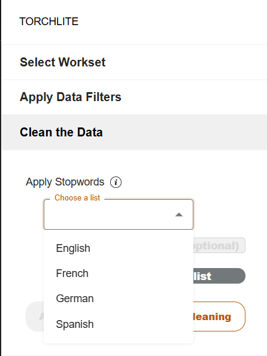
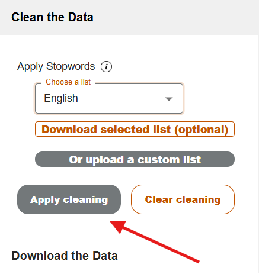
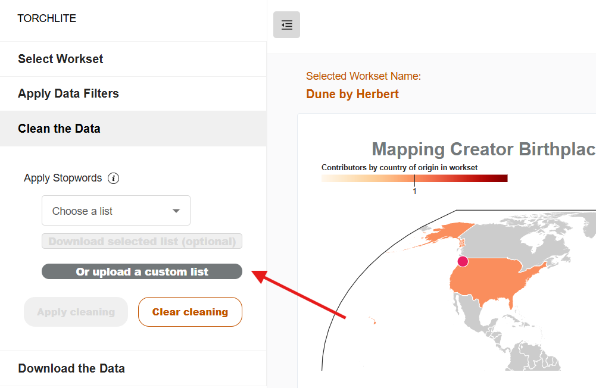
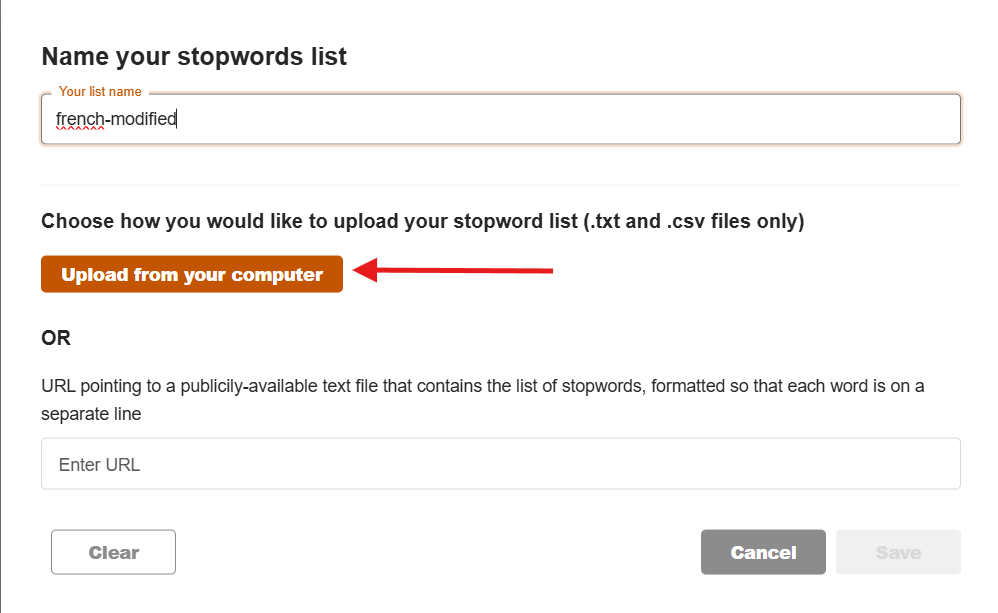
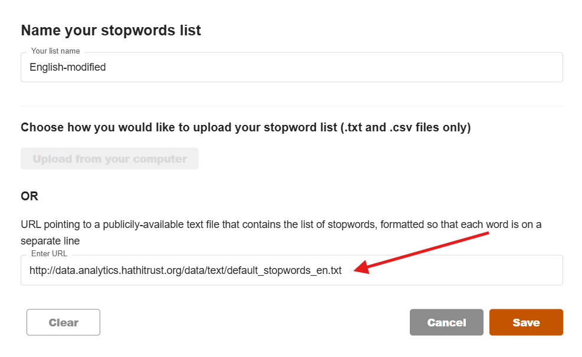
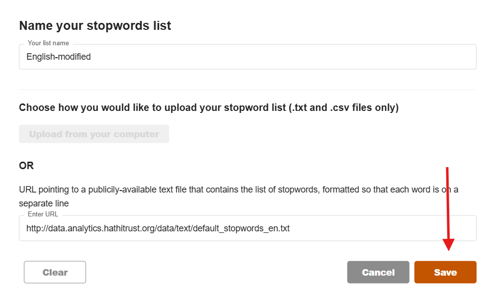

# How to clean workset data
This page will show you how to remove unwanted words and/or characters from your workset by apllying a list of stopwords to remove. Stopwords are common words in a language that you might want to filter out before processing text. They don't usually carry much meaning which is why people like to remove them from their data. Examples of potential stopwords in English include "the," "a," "is," "and," "in," and "of". 

To select or add a stopwords list, navigate to the clean the data section of the menu. You have the option of selecting from a pre-loaded stopword list based on the [Natural Language Toolkit’s stopword lists](https://www.nltk.org/) or uploading your own list. You can also download one of the pre-loaded lists, make adjustments, and upload it as a new list.

## Select a pre-loaded stopword list 
1.	Select Clean the Data from the side menu.

2. Select the language most relevant to your workset.
3. Click apply cleaning

## Upload your own list
1. Select Clean the Data from the side menu.
2. Select upload a custom list.

3. Name your custom list.
4. Click upload from your computer.

5. Select your text file from your computer.
6. Alternatively, you can enter a URL that points to a text file with your custom stop word list.

7. Click save.

8. Click apply cleaning.

