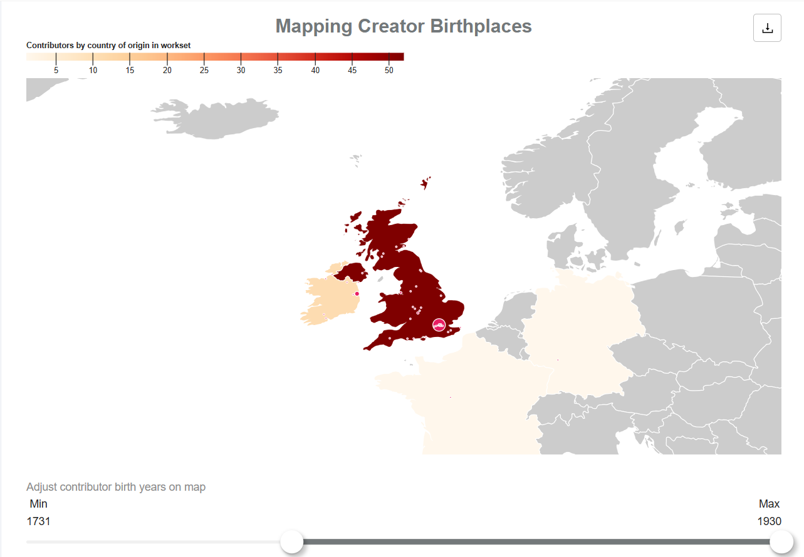
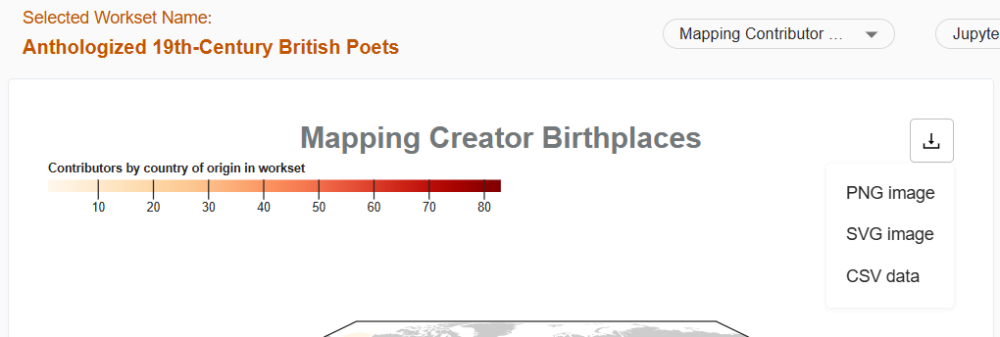

# Detailed view of visualizations

Detailed views of each visualization are available. This allows you to download images and the data specific to the visualization.

1.	Click on the title of the visualization, which is a link to the detailed visualization page.
2.	On the detailed visualization page, you can further filter the visualization or download the data for the visualization.

## Downloading visualization images and data

Downloads are available for each visualization in the form of a PNG file, SVG file, or CSV data file.

1. Click the download icon in the top right corner of the visualization.
2. Select from PNG image, SVG image, or CSV data to download.
