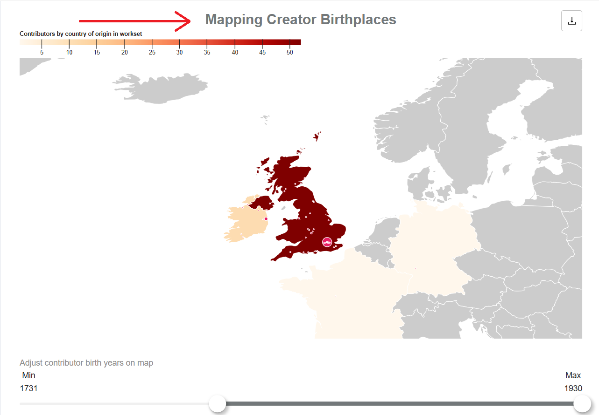
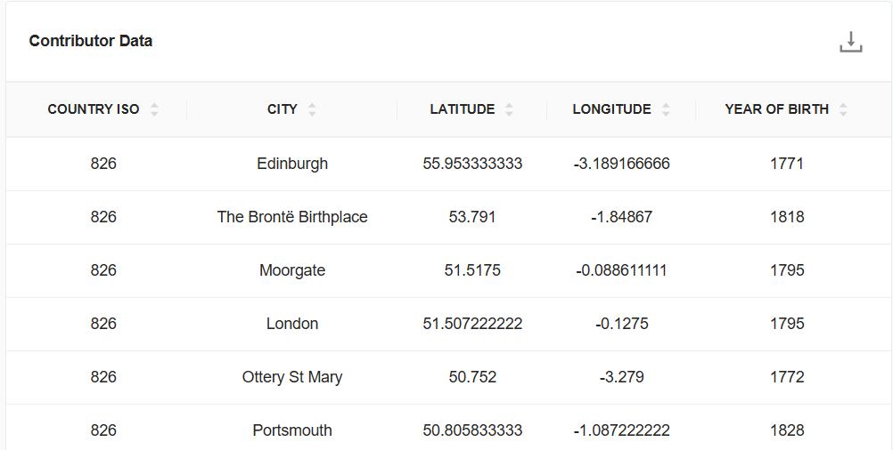
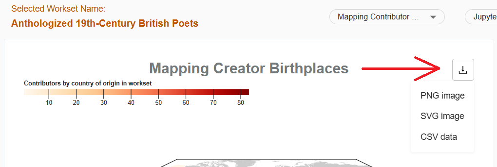

# Detailed view of visualizations

This page shows you how to see a detailed view of each visualization from the dashbooard. While the dashboard is interactive, you might want to examine a specific visualization closer or adjust parts of the visualiztion, which can be done by looking at the detailed view.

It will also show you how to download images and data specific to the visualization. Downloading the data will allow you to create your own visualizations outside of the dashboard.

## How to see a detailed view of the visualization

1.	Click on the title of the visualization, which is a link to the detailed visualization page.

2.	On the detailed visualization page, you can further filter the visualization or download the data for the visualization.

## Downloading visualization images and data

Downloads are available for each visualization in the form of a PNG file, SVG file, or CSV data file.

1. Click the download icon in the top right corner of the visualization.

2. Select from PNG image, SVG image, or CSV data to download.
