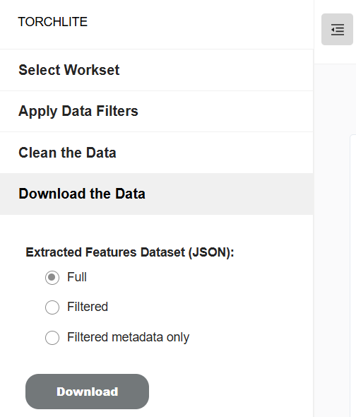

# Download the data
The extracted features data for a workset can be downloaded in the form of JSON files, using the download the data option. You can download the full data, filtered, or filtered metadata only.

