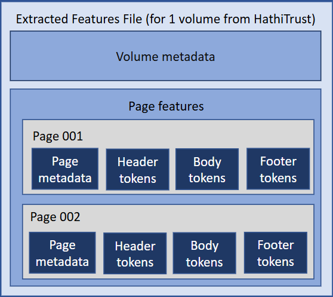

# What are extracted features?

The HTRC Extracted Features Dataset v.2.0 is composed of page-level features for 17.1 million volumes in the HathiTrust Digital Library. This version contains non-consumptive features for both public-domain and in-copyright books.

A full explanation of the dataset's features, motivation, and creation is available at the [EF Dataset documentation page](https://htrc.atlassian.net/wiki/spaces/COM/pages/43295914/Extracted+Features+v.2.0).

## Extracted features data model

Extracted features files are JSON files that contain bibliographic meatdata for each volume such as title, author, place of publication, etc. The files also contain page-level feature data such as part-of-speech tagged term token counts, header/footer identification, marginal character counts, and much more.

