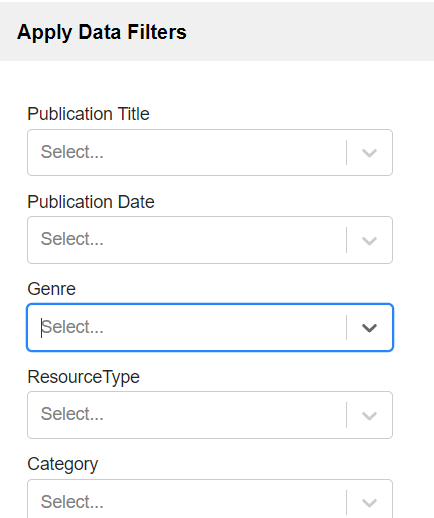

# Apply Data Filters
You can filter data based on several criteria such as the title, publication date, genre, and more.

1.	Select the filter you would like to use.
2.	You can type in a filter criterion or select from a dropdown list. Multiple criteria can be applied at the same time.
3.	Click apply filters.
