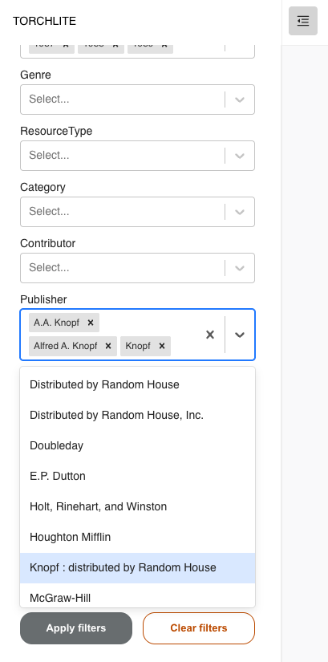

# How to apply data filters
This page will show you how to select and apply data filters to your workset. The application of filters will adjust the widgets to inclusively show volumes associated with your chosen filters (and exclude volumes not associated with selected filters). This helps you explore different views of the workset, and more finely tune your analysis. 

## Selecting data filters
You can filter data from your workset based on several criteria such as title, publication date, genre, and more. Filter options are based on metadata contained within the [Extracted Features dataset](https://htrc.github.io/torchlite-documentation/ef.html). 

1. Open the side menu to see the accordion menu headers. For larger screens it may already be visible, but for smaller screens you might have to select the open side menu button.

2. Select the “Apply Data Filters” header to open the accordion menu.

3. Once you have expanded the Apply Data Filters menu, you can start making selections for each filter category (they are all optional!). If there is a list of values in the dropdown, you can apply multiple values from each filter dropdown. If you change your mind about one of your choices, simply select the “x” next to the value and it will be removed from your analysis.

4. Once you have finished choosing your filter values, select the “Apply filters” button at the bottom of the menu.

5. Your widgets will update accordingly with the specified data. 
