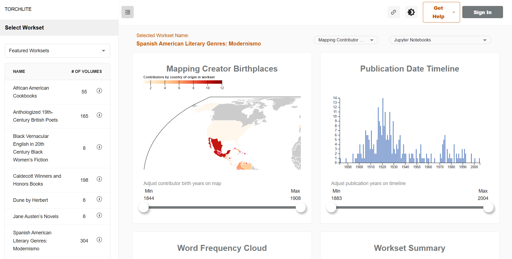

# About TORCHLITE

This page will describe in general what the **TORCHLITE Dashboard** is and its purpose. 

## What does TORCHLITE mean?
**TORCHLITE** is an acronym that stands for **Tools for Open Research and Computation with HathiTrust: Leveraging Intelligent Text Extraction**. 

There are three important pieces of this project to note:
* the TORCHLITE visualization dashboard (shown in the image below, and the primary feature of this documentation)
* the Extracted Features (EF) dataset
* the EF API

## What does the TORCHLITE Dashboard do?
Envisioned, built, and run by the [HathiTrust Research Center](https://analytics.hathitrust.org/) (HTRC), the [TORCHLITE Dashboard](https://torchlite.htrc.illinois.edu/dashboard) is a set of beginner-friendly visualization widgets that use text analysis methodologies to support interactive exploration of users’ own [worksets](https://analytics.hathitrust.org/staticworksets), or worksets that are publicly available. For instance, the [Mapping Contributor Birthplaces](https://torchlite.htrc.illinois.edu/widget-details/MappingContributorData?worksetId=&filters=) widget shows a map dotted with the birthplaces of contributors within the selected workset. A corresponding data table beneath the map provides metadata about the workset, including the country’s ISO number, city name, city latitude, city longitude, and the contributor’s year of birth. Each widget is different and shows something unique about the selected workset that you probably wouldn’t be able to easily track through traditional close reading practices. 

## Where does the TORCHLITE Dashboard get its data from? 
The TORCHLITE Dashboard gets its data from HTRC’s [Extracted Features dataset](https://analytics.hathitrust.org/deriveddatasets). You can [read more of our technical documentation](https://htrc.atlassian.net/wiki/spaces/COM/pages/43295914/Extracted+Features+v.2.0) on the dataset, but generally, the EF dataset provides volume-level and page-level data for 17.5 million individual volumes from the [HathiTrust Digital Library](https://www.hathitrust.org/). Page-level details include metadata such as part-of-speech tags for tokens (a.k.a. words) from each page,  token count, and header and footer information. This metadata (or “features”) can then be retrieved within the dashboard using a series of [EF API](https://htrc.stoplight.io/docs/ef-api/8xpvh96ani2e0-ef-api) calls created by HTRC. It is beyond the scope of this documentation to describe the technical mechanics behind the full retrieval process of the metadata, but it is helpful and important to understand where the data is coming from, even for a beginner!

## Who is this dashboard for?
The dashboard is intended for beginners and experts of text analysis alike, but built with beginners’ needs in mind (i.e., no coding is required!). It is a powerful tool for those who would like to explore collections with “distant reading” techniques (as opposed to the traditional close reading we are used to), and can help reveal the breadth of a workset from distinct perspectives, such as the prevalence of a certain year of publication for a specific demographic of writers, or the most common words in a particular author’s works. Please continue reading through the following pages to gain a deeper grasp for how to use each part of the dashboard.

## Please note:
This documentation is basic user documentation for the [TORCHLITE Dashboard](https://torchlite.htrc.illinois.edu/dashboard). For developer documentation related to extracted features and the visualization dashboard, please visit our [github repository](https://github.com/htrc).
