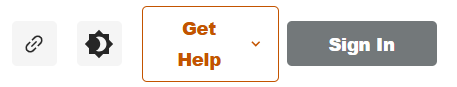
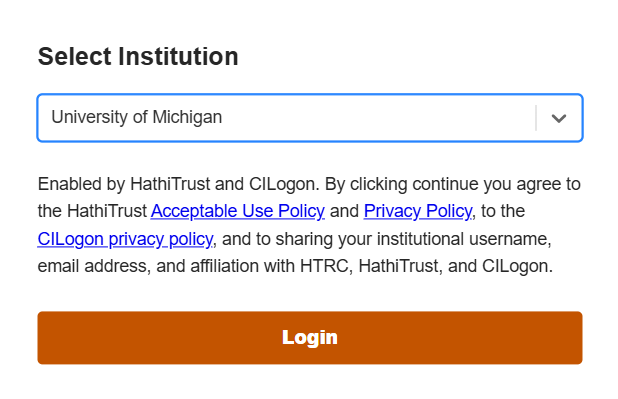
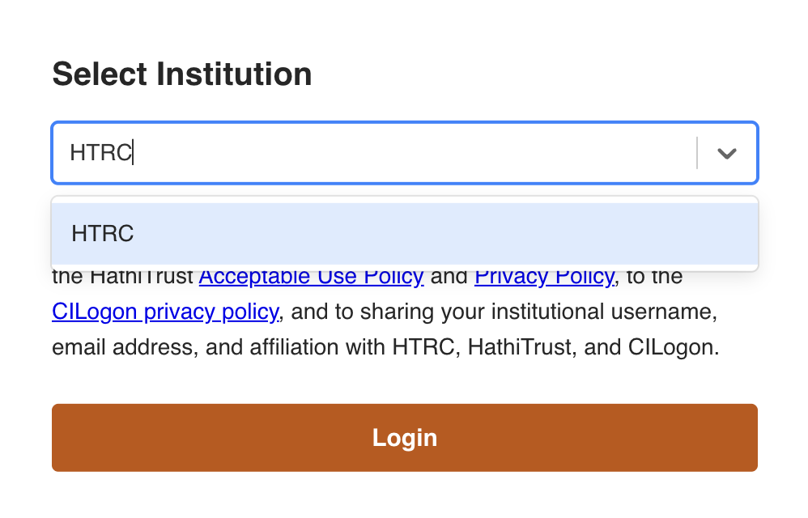
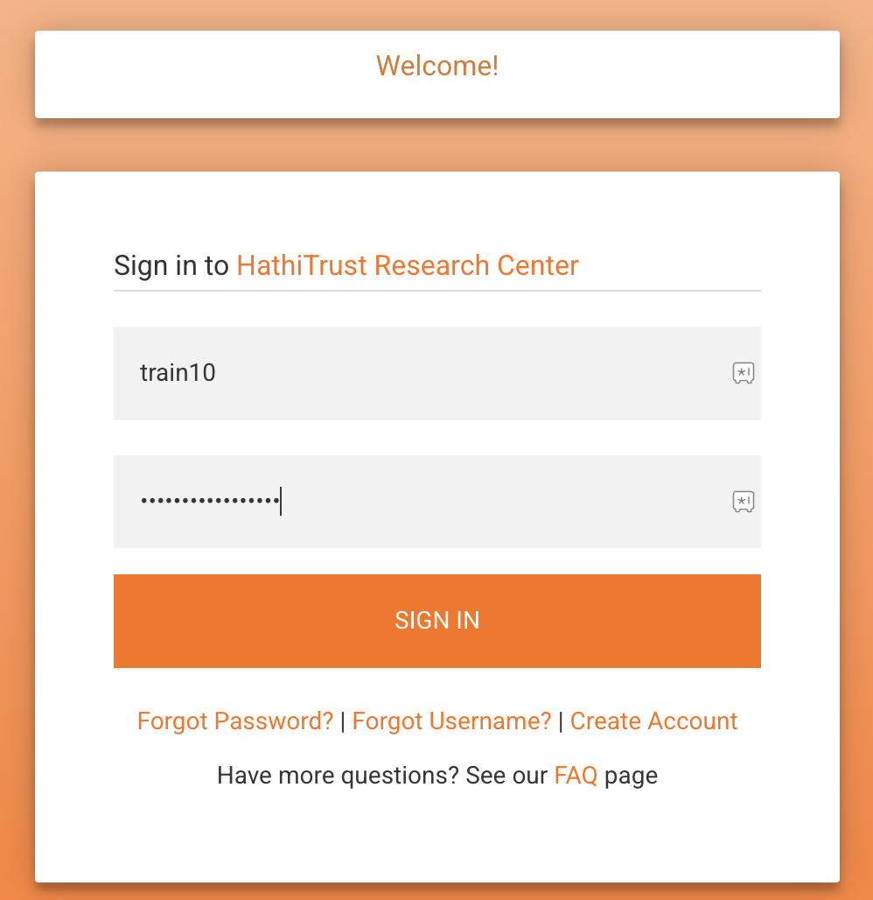
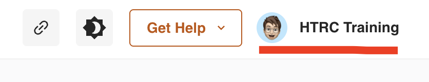

# How to sign in
This page will demonstrate the steps for signing into your HTRC account in order to access your personal worksets or to save your dashboard settings for future use.

## Steps if you hold a HathiTrust [member institution](https://www.hathitrust.org/member-libraries/member-list/) account, i.e., single sign on:

1. To sign in, select the sign in button in the top right corner.

2. Select your institution from the drop down menu and follow the steps provided for logging in with your institutional credentials.

3. If you do not have an account, create an account on [our sign up page](https://analytics.hathitrust.org/signuppage).

## Steps if you hold an HTRC-provided local account
1. Select the sign in button in the top right corner (see image above).

2. Type in ‘HTRC’ and select the option that appears in the dropdown. Then click the login button.

3. Enter your HTRC local account username and password on the sign in page.

4. Select the sign in button and you will now be signed into your TORCHLITE account.

### Note:
If you do not yet have an HTRC user account, please see the [User Accounts and Sign-in section](https://htrc.atlassian.net/wiki/spaces/COM/pages/43286644/Troubleshooting+and+FAQs#TroubleshootingandFAQs-UserAccountsandSign-in) of our FAQ page for full details on how to set one up. Only an HTRC account is required for logging into the TORCHLITE Dashboard. You do not need a separate Dashboard account to log in.
   
