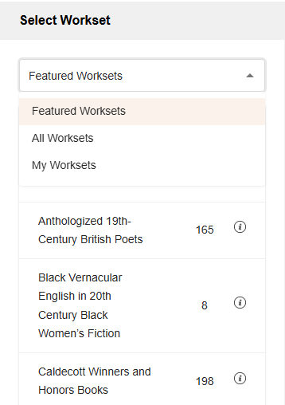
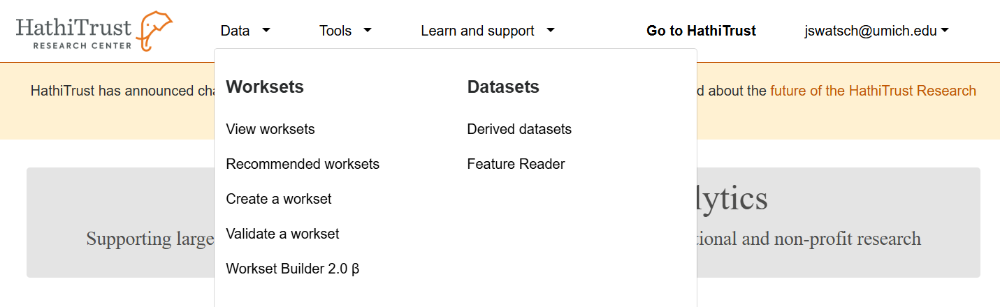

# How to select a workset

1.	Click Select Workset from the side navigation menu.
2.	Use the dropdown menu to view featured worksets, all worksets, or my worksets.
3.	Click the workset you want to load,

# How to select a workset you created
To visualize worksets you have created, select my worksets from the dropdown menu. All worksets you have created that are under 1000 volumes will appear as an option to visualize. 

# How to create a workset

1. Sign in to [https://analytics.hathitrust.org/](https://analytics.hathitrust.org/)
2. Select Data, then [Create a workset](https://analytics.hathitrust.org/createworkset) from the main navigation.
3. Chose upload a file, import from HathiTrust, or import from Workset Builder to create your workset. Detailed instructions and tutorials on creating worksets are available on our [documentation wiki](https://htrc.atlassian.net/wiki/spaces/COM/pages/43293699/HTRC+Worksets).
