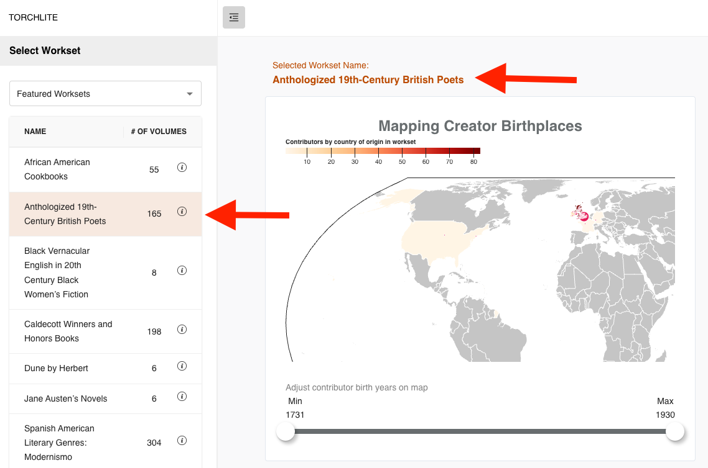

# How to select and create worksets
This page will show you how to select a workset to analyze in the TORCHLITE Dashboard, and also provides a brief overview of how to create your own workset inside of the **HTRC Analytics** site so that you can access it inside of the dashboard.

## Selecting a workset from the dashboard side menu
1. Expand the side menu to see the accordion menu headers. For larger screens it may already be visible, but for smaller screens you might have to select the expand side menu button.

2. Select the “Select Workset” header to open the accordion menu.

3. You can now see the list of Featured Worksets in the table beneath the dropdown menu.

4. You can select the dropdown menu above the worksets table to view different categories of worksets.
   

6. Select a workset from the table below that you would like to analyze. Once selected, the dashboard will reload with the data from your workset and show it in the widgets on the right side of the screen.

# How to select a workset you created
If you are [signed into your account](https://htrc.github.io/torchlite-documentation/signin.html), you will also be able to view all the worksets you have created in [HTRC Analytics](https://analytics.hathitrust.org/) that are under 1,000 volumes. Choose “My Worksets” from the dropdown and then select any of your available worksets now shown in the table. 

# How to create a workset
If you would like to create your own workset you can do this in the following way:

1. Sign in to [HTRC Analytics](https://analytics.hathitrust.org/)
2. From the main navigation, select **Data** and then **Create a workset**.

3. Choose **Upload a file**, **Import from HathiTrust**, or **Import from Workset Builder** to create your workset. Detailed instructions and tutorials on creating worksets are available on our [documentation wiki](https://htrc.atlassian.net/wiki/spaces/COM/pages/43293699/HTRC+Worksets).
